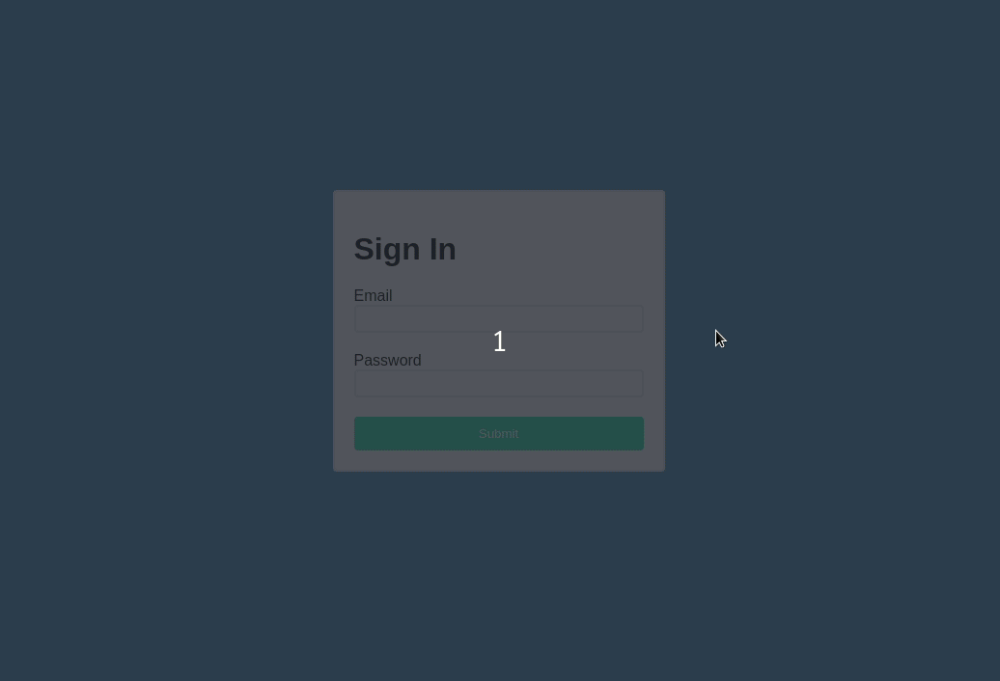

# About

A simple demonstration of new and upcoming features in React.

Example makes use of:

- Hooks
- Suspense (concurrent)
- Lazy Loading
- React Cache

> **Disclaimer:** Most of the features demonstrated and discussed are in the _alpha_ stage, will likely change, and should not be used in production.

### Demonstration



# Overview

## Suspense

Suspense has been available since the _v16.6_ release of React and isn't too theoretically different from a try-catch block. In short, if any of the children of a _Suspense_ component are not ready to be rendered, the provided fallback content is rendered.

Experimenting with concurrent React (_v16.7-alpha_ and later), a _maxDuration_ prop can be used. This tells the _Suspense_ component how many milliseconds to wait before rendering the fallback component.

```
<Suspense maxDuration={500} fallback={Spinner}>
  <Users />
</Suspense>
```

> Example can be found in [_src/App.jsx_](src/App.jsx)

## Lazy loading

Lazy loading is another sweet addition since _v16.6_ which allows the browser to asynchronously load code at runtime - preventing render blocking. When coupled with _Suspense_, we get a clean and simple method for rendering components into an existing DOM as they become available.

In the example below, a _Spinner_ component is displayed until the _Users_ component is being loaded.

```
// Blocking imports
import { Suspense } from 'react';
import { Spinner } from './components/Spinner';

// Non-blocking import
const Users = lazy(() => import("./components/Users"));

export function App() {
  return (
    <Suspense maxDuration={500} fallback={Spinner}>
      <Users />
    </Suspense>
  );
}
```

> Example can be found in [_src/App.jsx_](src/App.jsx)

## Resource fetching

Now if you're feeling really experimental, you might want to check out _react-cache_. It's a new work-in-progress utility for simplifying the process of asynchronously fetching resources. In the examples below, you will see that resources (such as an API response or an image) are declared externally from components and then read during the render function.

In the case that a resource read is in progress at render time, the soonest parent _Suspense_ component will make use of the fallback component until the asynchronous read is complete.

### Examples

#### Making an API call

```
import React from 'react';
import { unstable_createResource as createResource } from 'react-cache';
import { User } from './User';

const usersResource = createResource(async () => {
  const response = await fetch('https://reqres.in/api/users');
  const body = await response.json();
  return body.data;
});

export default function Users() {
  const users = usersResource.read();

  return users.map((userProps, i) => <User key={i} {...userProps} />);
}
```

> Example can be found in [_src/components/Users.jsx_](src/components/Users.jsx)

#### Fetching an image

```
import React from 'react';
import { unstable_createResource as createResource } from 'react-cache';

const imageResource = createResource(src => {
  const img = new Image();
  return new Promise(resolve => {
    img.onload = () => resolve(src);
    img.src = src;
  });
});

export function User(props) {
  const loadedImage = imageResource.read(props.avatar);

  return (
    <div className="user">
      
      <p>
        {props.first_name} {props.last_name}
      </p>
    </div>
  );
}
```

> Example can be found in [_src/components/User.jsx_](src/components/User.jsx)

# More Info

Facebook have some great blogs and demonstrations on the latest features of React which you can find below.

- [React v16.6.0: lazy, memo and contextType](https://reactjs.org/blog/2018/10/23/react-v-16-6.html)
- [Concurrent Rendering in React - Andrew Clark and Brian Vaughn - React Conf 2018](https://www.youtube.com/watch?v=ByBPyMBTzM0)
